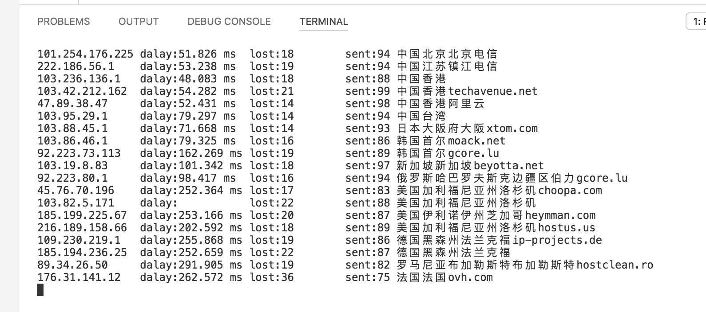

# MultiPing
Network packet loss analysis script

同时ping多个服务器并统计丢包率, 观察线路的国际出口情况, 便于ss/ssr线路选择
# 效果图

# 加入新的ip
在multiping.py的ip列表中加入, 注意格式 'your ip',
>ip = [  '101.254.176.225', '222.186.56.1', '103.236.136.1', ...
# 使用事项

1.丢包情况直接看lost值就可以了

2.delay不显示表示上一次ping失败了

3.ip归属地是火猫的免费接口
